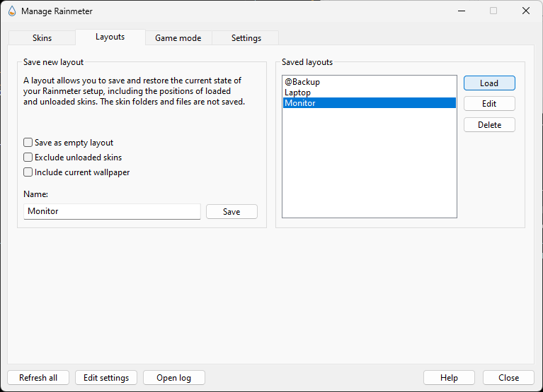

# 🔮 Code Geass Rainmeter Skins

This repository contains custom Rainmeter skins inspired by *Code Geass*. Follow the steps below to set up and use the skins on your own machine.


## 📋 Prerequisites

Before using these skins, you must have **Rainmeter** installed on your computer.

### 🔽 Installing Rainmeter

1. Download the latest version of Rainmeter from the official website:  
   [https://www.rainmeter.net/](https://www.rainmeter.net/)
   
2. Follow the installation instructions provided on the website to install Rainmeter.

## 🚀 Setup Instructions

### 1️⃣ Replace the `Skins` Folder

1. **Download the Repository** 📥  
   Clone or download this repository to your local machine.

2. **Navigate to Your Rainmeter Skins Folder** 📁  
   By default, your Rainmeter skins should be located at:

   ``C:\Users\ {Your Username} \Documents\Rainmeter\Skins``


3. **Replace the Skins Folder** 🔄  
Delete the existing `Skins` folder and replace it with the `Skins` folder from this repository.

### 2️⃣ Replace the Layout Skin

1. **Navigate to the Layout Skin Folder** 📁  
Open the following directory: 

    ```C:\Users\ {Your Username} \Appdata\Roaming\Rainmeter\ ```


2. **Replace the Layout File** 🔄  
Delete the existing `Layout` folder and replace it with the `Layout` folder from this repository.

### 3️⃣ Load the Skins in Rainmeter

1. **Open Rainmeter** 🖥️  
Launch Rainmeter from the Start Menu.

2. **Unload / Delete default Skins** 🗑️  
Unload or delete the default rainmeter skin

3. **Load Skins** ✨  

Open the `Layouts` tab, select `Laptop` or `Monitor` layout (depending on your screen size) and click `Load`


## 🎨 Support

If you'd like to customize your own **Honeycomb** icons, I recommend checking out the following YouTube videos:

- [How to Customize Honeycomb Icons](https://www.youtube.com/watch?v=Z1RAFscuFAE&ab_channel=Mork) by Mork 🎬

### ✨ Creating the Hover Effect

To create a hover effect for your icons, you can follow this tutorial:

- [How to Create Hover Effects](https://www.youtube.com/watch?v=4FyO0uf512U&ab_channel=RacTac) by RacTac 🎬


## ❓ Troubleshooting

- If you don't see the skins or layout after following the steps, make sure that you've replaced the files in the correct directories and refreshed Rainmeter.
- Check if Rainmeter is up-to-date; older versions may not support certain features.

---

